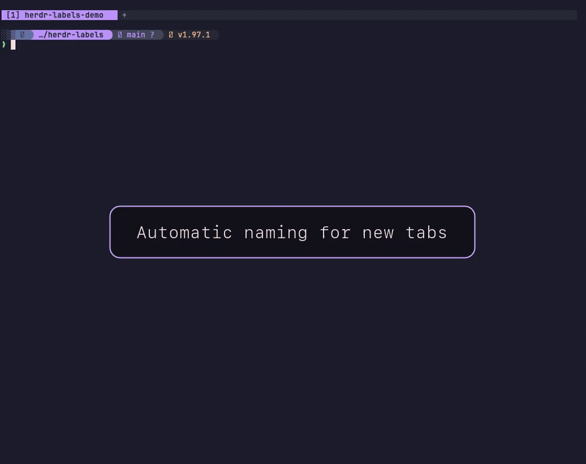

# Herdr Labels

A [Herdr](https://herdr.dev) plugin that automatically names eligible
tabs after their foreground process and keeps every tab label prefixed with its
one-based position, such as `[1] zsh`, `[2] nvim`, and `[3] tests`.



## Motivation

Herdr's default tab labels make tab numbers visible when tabs use the default
numeric naming scheme. Giving a tab a descriptive label makes it easier to
recognize, but loses that immediately visible numeric reference. This plugin
combines both in a consistent format: a prominent number in square brackets
next to a human-friendly label.

That combination improves keyboard navigation. Users can scan the tab bar for a
descriptive label, see its number beside it, and quickly switch to it with
`<prefix> + <1..9>`.

The numbering stays accurate when tabs are created, deleted, reordered, or
renamed. New tabs with Herdr-generated numeric labels are adopted for automatic
naming. Renaming a tab to a meaningful label gives that tab a fixed name while
its number remains up to date. Resetting the tab, assigning a whitespace-only
label, or using the toggle can hand it back to automatic naming.

The Rust engine communicates directly with Herdr's local socket. It uses no
runtime shell engine or `jq`, keeps ownership state isolated by Herdr session,
and re-reads a tab immediately before each rename to avoid applying stale work.
Ownership persists across Herdr restarts and is partitioned by socket path, so
named sessions do not share tab state.

## Requirements

- Herdr 0.7.5 or newer
- macOS or Linux on Intel/AMD64 or ARM64
- `curl` or `wget`
- `sha256sum` or `shasum`

Installation downloads the matching prebuilt binary from GitHub Releases and
verifies its SHA-256 checksum. Rust and Cargo are not required.

## Install

```bash
herdr plugin install Angel-O/herdr-labels
```

Restart the Herdr server after installation to run the initial reconciliation.
Later tab creation, closure, movement, and rename events are handled
automatically.

## Shell hooks

Herdr does not emit an event when a shell command starts or returns to its
prompt. The optional hooks make names update immediately. They no-op outside a
Herdr pane and launch the plugin binary asynchronously.

For Zsh, add this to `~/.zshrc`:

```zsh
for _f in ${HOME}/.config/herdr/plugins/github/angel-o.labels-*/shell/hook.zsh(N); do
  source $_f
  break
done
```

For Bash, add this to `~/.bashrc`:

```bash
for _f in "$HOME"/.config/herdr/plugins/github/angel-o.labels-*/shell/hook.bash; do
  [ -r "$_f" ] && { source "$_f"; break; }
done
```

Without a hook, automatic naming still converges on Herdr focus and pane events.
For a new generated tab, ambient events accept only a configured shell as the
first semantic name; startup helpers cannot claim the tab before the shell is
ready. A verified `preexec` or the first `precmd` can establish the name
immediately.
When Bash already has a `DEBUG` trap and exposes no `preexec_functions` hook
array, Herdr Labels preserves that trap and provides prompt-time updates only.

## Control behavior

Automatic naming and numbering are independent. You can configure their global
defaults, opt individual tabs in or out of automatic naming, or suspend all
label changes in one Herdr session.

### Global configuration

The defaults enable automatic naming and numbering. To customize them, copy
`config.example.toml` to `${XDG_CONFIG_HOME:-$HOME/.config}/herdr-labels/config.toml`.
Override that path with `HERDR_LABELS_CONFIG`.

```toml
auto_name_tabs = true
number_tabs = true
hide_idle_shell = false
max_label_chars = 24

shells = ["zsh", "bash", "sh", "dash", "ksh"]
ignored_processes = ["ls", "cat", "pwd", "clear", "git", "direnv"]

[process_aliases]
bv = "beads_viewer"
```

Generated labels remove terminal control characters and never include command
arguments.

The two primary settings control all tabs:

| Setting | `true` | `false` |
| --- | --- | --- |
| `auto_name_tabs` | Eligible tabs follow their foreground process. | Process changes do not rename tabs. |
| `number_tabs` | Every tab keeps its one-based `[n]` prefix. | Generated number prefixes are removed and no longer added. |

These settings are independent. For example, setting `auto_name_tabs = false`
and `number_tabs = true` keeps tab numbers current without changing semantic
names. Per-tab actions cannot override a globally disabled `auto_name_tabs`
setting.

### Individual tabs

When global automatic naming is enabled, you can choose the behavior of each
tab independently. Numbering continues in every case when `number_tabs` is
enabled.

- Rename a tab to a non-blank label to keep that name fixed and stop automatic
  naming for that tab.
- Rename a tab to a whitespace-only label, such as one space, to restore
  automatic naming. A completely empty field cancels Herdr's rename.
- Use `toggle` to switch the current tab between a fixed name and automatic
  naming.
- Use `reset` when you only want to ensure that automatic naming is enabled for
  the current tab.

Toggle the current tab between automatic and fixed naming (or use the
keybinding below):

```bash
herdr plugin action invoke toggle --plugin angel-o.labels
```

Reset the current tab to automatic naming:

```bash
herdr plugin action invoke reset --plugin angel-o.labels
```

### Toggle keybinding

To bind this toggle to `prefix+option+r` on macOS (`prefix+alt+r` in Herdr's
key syntax), add this to `~/.config/herdr/config.toml`:

```toml
[[keys.command]]
key = "prefix+alt+r"
type = "plugin_action"
command = "angel-o.labels.toggle"
description = "toggle automatic tab naming"
```

Reload the configuration after editing it:

```bash
herdr server reload-config
```

### Session-wide suspension

Clear number prefixes and suspend changes in the current session:

```bash
herdr plugin action invoke clear --plugin angel-o.labels
```

Unlike `auto_name_tabs = false`, `clear` also suspends numbering. Invoking
`reset` or `toggle` later resumes the session and applies that action to the
current tab.

## Uninstall

Herdr cannot reconstruct labels that existed before the plugin renamed them.
Before removing the plugin, use `clear` to strip its numeric prefixes and leave
the current semantic names in place:

```bash
herdr plugin action invoke clear --plugin angel-o.labels
```

Run that action once in each named Herdr session whose labels should be cleaned.
Then remove the plugin registration that matches how it was added:

```bash
# GitHub installation
herdr plugin uninstall angel-o.labels

# Locally linked checkout
herdr plugin unlink angel-o.labels
```

Shell integration is configured manually and therefore is not removed by Herdr.
Delete the Herdr Labels block or `source` line you added to `~/.zshrc` or
`~/.bashrc`. Existing shells retain already-loaded hook functions, so close
them or replace them with a new shell after editing the startup file. This step
is especially important for a local link because its binary remains available
after `plugin unlink`.

The plugin no longer has any active functionality after its registration and
shell hooks are removed. To also delete its retained settings and per-session
ownership state, remove these directories:

```bash
rm -rf "${XDG_CONFIG_HOME:-$HOME/.config}/herdr-labels"
rm -rf "${XDG_STATE_HOME:-$HOME/.local/state}/herdr-labels"
```

Deleting those directories is optional and irreversible. They contain no code
that runs on its own.

## Local setup

Local development requires Rust 1.89 or newer and Cargo.

Build the binary:

```bash
cargo build --release
```

Link the plugin from this directory:

```bash
herdr plugin link "$PWD"
```

To exercise immediate naming from the linked checkout in every new Zsh, add the
following to `~/.zshrc`:

```zsh
source /absolute/path/to/herdr-labels/shell/hook.zsh
```

Restart the Herdr server to run the startup reconciliation.

## Development

```bash
cargo fmt --check
cargo test
cargo clippy --all-targets --all-features -- -D warnings
RUSTDOCFLAGS="-D warnings" cargo doc --no-deps --document-private-items
tests/test-hooks.sh
scripts/check-version.sh
scripts/test-install.sh
```

Concurrent work uses an OS-backed per-session lock. Structural events coalesce
into one final pass, while explicit shell transitions and actions retain their
operation-specific meaning. State lives
under `${XDG_STATE_HOME:-~/.local/state}/herdr-labels/`, partitioned by a stable
hash of the Herdr socket path. Use a private, absolute `XDG_STATE_HOME`.

Herdr's current rename API does not provide an atomic expected-label condition.
The plugin re-reads immediately before mutation, which closes ordinary stale
plans but leaves a very small race if a user rename lands between that read and
the rename request.

Release maintainers should follow [RELEASING.md](RELEASING.md).
The implementation structure is documented in
[docs/ARCHITECTURE.md](docs/ARCHITECTURE.md).

## Contributing

Contributions are welcome. See [CONTRIBUTING.md](CONTRIBUTING.md) for development
setup, project conventions, and required checks.

## License

[MIT](LICENSE)
